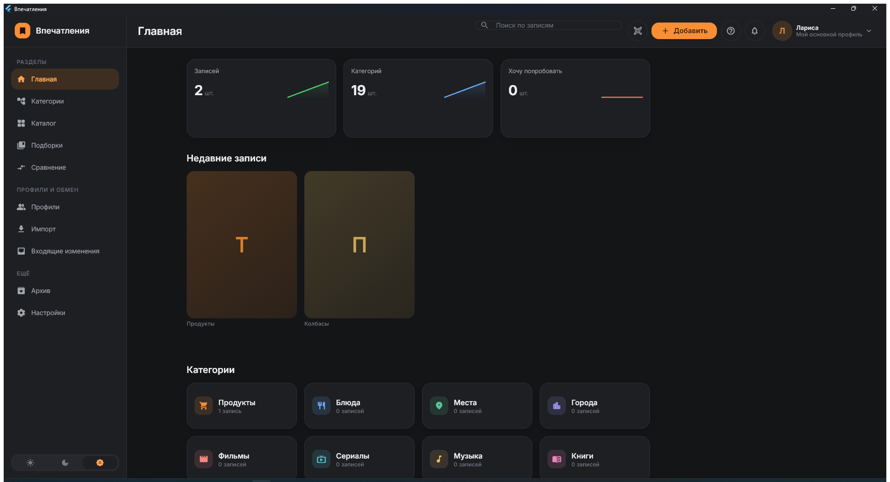
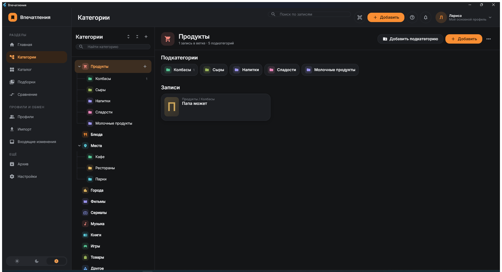
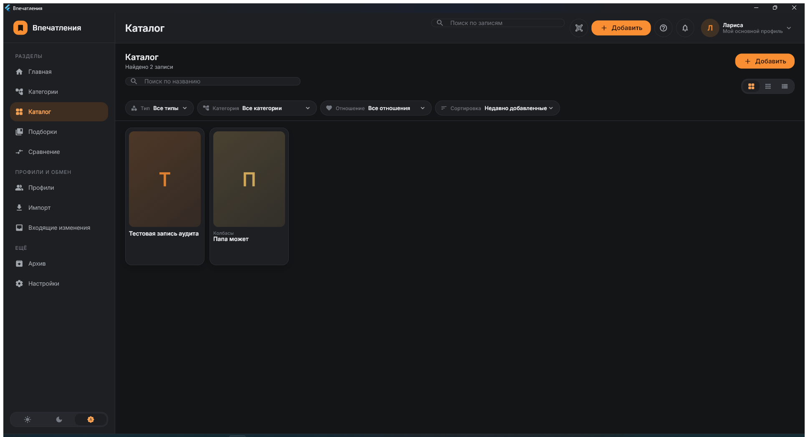
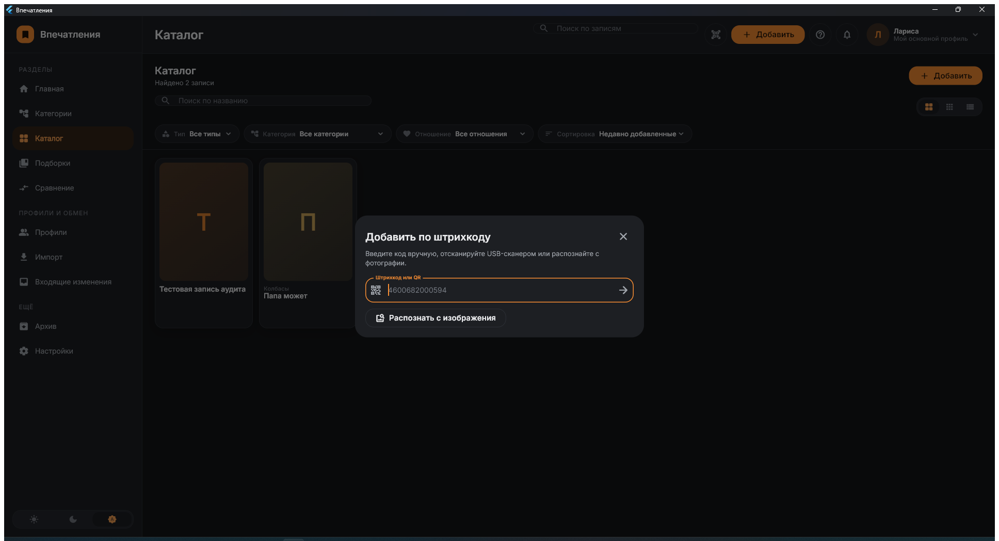

<div align="center">

# Впечатления

**Личная медиатека вкусов: что вам понравилось, что нет и что стоит попробовать.**

Всё хранится на вашем устройстве. Делиться — файлом, который вы создаёте сами.

[](https://github.com/Lucky2356/Impressions/releases/latest)
[](#установка)
[](#для-разработчиков)
[](LICENSE)

</div>

---

## Зачем это

Вы попробовали колбасу, которая оказалась отличной. Через полгода стоите в магазине и не помните название. Посмотрели фильм по совету друга — и не можете вспомнить, кто советовал и понравилось ли вам вообще.

«Впечатления» — место, где это хранится. Продукты, блюда, фильмы, книги, игры, места, города, товары и любые ваши собственные типы. Не оценки «для всех», а именно ваши.

Ключевая идея: **мнение отделено от объекта**. Фильм «Интерстеллар» — один общий объект. Ваша оценка и оценка вашей жены — две независимые записи. Изменив одну, вы не трогаете другую. Поэтому профилями можно обмениваться, не боясь, что чужое мнение перепишет ваше.

## Как выглядит

| | |
|:--:|:--:|
|  |  |
| Сводка профиля | Дерево категорий и содержимое ветки |
|  |  |
| Каталог с фильтрами | Добавление товара по коду |

## Установка

**Windows** — скачайте установщик со [страницы выпусков](https://github.com/Lucky2356/Impressions/releases/latest) и запустите. Права администратора не нужны, программа ставится в профиль пользователя. Удаляется как обычное приложение; данные при этом остаются.

**Android** — скачайте APK оттуда же и разрешите установку из неизвестных источников.

Регистрация, аккаунт и интернет не нужны.

## Что умеет

**Раскладывать по полкам.** Дерево категорий любой вложенности с перетаскиванием веток, теги как отдельные плоские метки, подборки-списки с ручным порядком. Случайное действие ничего не теряет: убранное уходит в архив, откуда возвращается целым. Удалить насовсем можно только оттуда и только с явным подтверждением.

**Запоминать быстро.** Для новой записи хватает названия. Дальше — отношение от «обожаю» до «избегаю», оценка, заметка, дата впечатления, фотографии, теги и подборка: всё в одной форме, без повторного открытия записи. Снимок можно перетащить прямо в окно, а выбранная обложка видна на карточке в каталоге. Каждое изменение сохраняется отдельной версией, любую можно вернуть.

**Добавлять товары по штрихкоду.** Камера на Android, USB-сканер или ручной ввод — везде, распознавание с фотографии — тоже. Название и бренд подтягиваются из открытых товарных баз, где хорошо представлены российские товары.

**Находить.** Полнотекстовый поиск по названиям и по тексту заметок — «е» и «ё» считаются одной буквой. Фильтры по типу, категории, отношению и тегам, отдельно «без оценки», «без категории» и «без фотографии»; четыре порядка сортировки в обе стороны, три режима отображения. Выделив несколько записей, можно разом разложить их по категориям, пометить тегом или убрать в архив.

**Понимать себя.** Отдельный экран статистики: распределение оценок, доли отношений, самые заполненные категории, динамика по месяцам. Список «Хочу попробовать» — то, до чего ещё не дошли руки; отметка «попробовал» сразу спрашивает оценку.

**Забирать с собой.** Кроме контейнера обмена записи выгружаются в таблицу CSV или текст Markdown — открыть в Excel, распечатать, перенести куда угодно.

**Делиться.** Профиль выгружается в подписанный файл `*.impressions` — целиком, веткой или подборкой, с фотографиями или без, при желании под паролем. Друг импортирует его к себе и сравнивает вкусы с вашими в шести режимах: что нравится обоим, что есть только у него, где оценки сильно расходятся. Повторный импорт обновляет копию, а не плодит дубли.

## Приватность

Записи, фотографии и ключи не покидают устройство. Нет сервера, облака, регистрации, аналитики, рекламы и телеметрии.

Сетевых обращений ровно три, все отключаются в настройках, и ни одно не передаёт содержимое записей:

| Когда | Куда | Что уходит |
| --- | --- | --- |
| Вы отсканировали или ввели штрихкод | Включённые товарные базы | Только сам штрихкод |
| Автодополнение товаров *(по умолчанию выключено)* | Они же | Штрихкоды карточек с пустыми полями |
| Проверка обновлений | `api.github.com` | Ничего, кроме самого запроса |

Обмен между людьми идёт только файлом, который создаёте вы. Он подписан ключом Ed25519, при импорте проверяются контрольные суммы и подпись, а перед применением делается резервная копия.

Раз в неделю приложение делает резервную копию само — это выключается в настройках. Копии лежат рядом с базой и разворачиваются оттуда же: перед заменой приложение проверяет копию по контрольным суммам и отдельно сохраняет нынешнее состояние. По желанию копии защищаются паролем — тогда унесённая с устройства копия без него не читается, а на своём устройстве разворачивается без лишних вопросов.

Подробности — в [PRIVACY.md](PRIVACY.md) и [SECURITY.md](SECURITY.md).

## Чего пока нет

- Камера-сканер работает на Android; на Windows код вводится вручную, USB-сканером или распознаётся с изображения.
- С фотографии читаются EAN-13, EAN-8 и UPC-A. Code 128 и ITF-14 — нет.
- Интерфейс только на русском.
- iOS не собирается, хотя архитектура к этому готова.

---

<details>
<summary><b>Для разработчиков</b></summary>

### Стек

Flutter · Dart · Material 3 · Riverpod · Drift/SQLite (FTS5) · cryptography (Ed25519, AES-GCM, ChaCha20-Poly1305) · image · zxing2 · mobile_scanner · http · file_selector · desktop_drop · archive · intl

Дизайн-система своя: токены, темы, компоненты и golden-тесты. Раскладка считается от ширины окна и рассчитана на разрешения от Full HD до 4K — на широком мониторе растёт число карточек в ряду, а не их размер.

### Сборка

Нужны Flutter stable 3.44+, Android SDK для APK, Visual Studio с компонентами Desktop C++ и включённый режим разработчика Windows. Для установщика — [Inno Setup 6](https://jrsoftware.org/isinfo.php) (`winget install JRSoftware.InnoSetup`).

```powershell
./scripts/bootstrap.ps1       # зависимости и кодогенерация
./scripts/check.ps1           # формат, анализ, все тесты
./scripts/build_windows.ps1   # build/windows/x64/runner/Release/
./scripts/build_installer.ps1 # dist/Impressions-<версия>-windows-x64-setup.exe
./scripts/build_android.ps1   # build/app/outputs/flutter-apk/app-release.apk
```

### Установщик Windows не подписан

При установке Windows SmartScreen покажет «Неизвестный издатель». Это не признак проблемы с файлом: подпись кода требует платного сертификата, которого у проекта нет. Проверить, что файл тот самый, можно по контрольной сумме из описания выпуска.

Приложение сверяет её само, когда обновляется через «Проверить обновления»: скачанный файл сравнивается с суммой, которую сообщает GitHub, и при несовпадении удаляется, не запускаясь.

### Ключ подписи Android

Релизный APK подписывается собственным ключом. Без него сборка релиза не начнётся — это намеренно: отладочный ключ одинаков у всех и лежит с общеизвестным паролем.

Ключ создаётся один раз. `keytool` входит в JDK и обычно не прописан в PATH — он лежит рядом с Java, которую использует Flutter (путь показывает `flutter doctor --verbose`, строка «Java binary at»). Для Android Studio это:

```powershell
& "C:\Program Files\Android\Android Studio\jbr\bin\keytool.exe" -genkeypair -v -keystore android\impressions.jks -keyalg RSA -keysize 4096 -validity 10000 -alias impressions
```

Формат по умолчанию — PKCS12; пароль хранилища и пароль ключа делаются одинаковыми. Команда спросит пароль, затем имя и организацию (можно оставить пустыми) и подтверждение — на последний вопрос ответить `да`.

Рядом кладётся `android/key.properties`:

```properties
storeFile=impressions.jks
storePassword=<пароль хранилища>
keyAlias=impressions
keyPassword=<пароль ключа>
```

Оба файла в `.gitignore` и в репозиторий не попадают. Образец полей — `android/key.properties.example`.

**Ключ нельзя терять.** Android разрешает обновление только сборкой с той же подписью. Потеряв ключ, обновить уже установленные копии будет нечем: приложение хранит всё локально, поэтому переустановка означает потерю записей. Храните `.jks` и пароли там же, где остальные важные пароли, и держите отдельную копию.

Проверить, чем подписан собранный APK:

```powershell
keytool -printcert -jarfile build/app/outputs/flutter-apk/app-release.apk
```

В выводе не должно быть `CN=Android Debug`.

### Тесты

303 теста: нормализация и хеши, декодирование штрихкодов из синтезированных изображений (включая повёрнутые и зеркальные), дерево категорий, версии записей, полнотекстовый поиск, возврат из архива, транзакции, обработка изображений, криптография, сквозной цикл экспорт → импорт → повторный импорт, создание и восстановление резервных копий, окончательное удаление, подстановка типа записи по ветке, устойчивость вёрстки к длинным названиям и к ширине телефона, выдача готового файла на телефоне и на компьютере, экраны и golden-эталоны.

```powershell
./scripts/check.ps1
```

### Документация

| Файл | О чём |
| --- | --- |
| [ARCHITECTURE.md](ARCHITECTURE.md) | Слои, принципы, карта экранов |
| [DATA_MODEL.md](DATA_MODEL.md) | Таблицы, индексы, выбор стратегии дерева |
| [CATEGORY_SYSTEM.md](CATEGORY_SYSTEM.md) | Категории, теги, перемещение, сопоставление деревьев |
| [PROFILE_MODEL.md](PROFILE_MODEL.md) | Профили, устройства, ключи |
| [DESIGN_SYSTEM.md](DESIGN_SYSTEM.md) | Палитра, типографика, компоненты, адаптивность |
| [IMPORT_EXPORT_FORMAT.md](IMPORT_EXPORT_FORMAT.md) | Формат контейнера `*.impressions` |
| [SECURITY.md](SECURITY.md) | Модель угроз, криптография, безопасный импорт |
| [PRIVACY.md](PRIVACY.md) | Что и куда передаётся |
| [DEVELOPMENT.md](DEVELOPMENT.md) | Требования, структура, соглашения |
| [TESTING.md](TESTING.md) | Состав тестов, golden-эталоны |
| [CHANGELOG.md](CHANGELOG.md) | История изменений |

### Горячие клавиши

`Ctrl+N` новая запись · `Ctrl+B` сканировать код · `Ctrl+F` поиск · `Ctrl+I` импорт · `Ctrl+E` экспорт · `Ctrl+P` профили · `Ctrl+,` настройки · `Esc` закрыть диалог

В каталоге: стрелки — переход по карточкам, `Enter` — открыть, `Ctrl` + нажатие — выделить, `Ctrl+A` — выделить все, `Esc` — снять выделение, правая кнопка — меню действий.

</details>

---

Название рабочее и меняется в одном месте — `lib/core/config/app_config.dart`.

Лицензия — [MIT](LICENSE).
